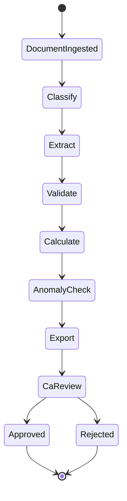

# SmartITR — The Complete Blueprint (Productized)
From Zero to ₹100 Crore: PRD + Technical Spec + GTM Playbook

**Version**: 0.1 (draft)  
**Date**: 2026-03-19  
**Owner**: SmartITR

---

## 1) Executive summary

### 1.1 What you’re building (levels)

- **Surface**: AI tool that helps CA firms process tax documents
- **One level deep**: workflow automation platform replacing manual data entry
- **Actual business**: India’s financial document intelligence infrastructure
- **Endgame**: the data layer powering CA firms, banks/lenders, and insurers across India

SmartITR starts with tax documents because they’re **painful, mandatory, and recurring**—but the compounding asset is a growing dataset of structured Indian financial data that improves extraction, validation, and downstream automation each year.

### 1.2 Why now (2026)

Five converging forces:

- **Tax regime shift**: simple salaried filing is commoditized; complex filers remain painful (traders, freelancers, crypto, business owners).
- **CA bottlenecks**: small practices spend most time on downloads, WhatsApp chasing, PDF reading, and manual transcription.
- **AI capability threshold**: modern models + OCR can parse messy Indian financial docs at high accuracy.
- **ICAI modernization tailwind**: increased openness to digital transformation.
- **Market gap**: major incumbents target consumers; CA workflow automation is open.

### 1.3 Core insight (distribution)

**CAs are the distribution channel; their clients are the end users.**  
Acquire tens of thousands of taxpayer relationships by signing hundreds of CA firms.

Implications:

- Low/no consumer marketing spend
- Trust piggyback (client trusts CA)
- Annual recurring cycle (taxes repeat)
- Natural expansion into adjacent services (GST/TDS/audit; later embedded finance)

### 1.4 Non‑negotiables (golden rules)

1) **AI extracts and classifies. Never calculates.**  
All tax math must be **deterministic Python rules engine**. Wrong tax numbers are fatal (notices → CA loses client → CA churn → reputational damage).

2) **All data stays in India (AWS Mumbai, ap-south-1) only.**  
DPDP Act + Rules require strong data governance; architect for India-only residency by default.

3) **CA controls everything; SmartITR is infrastructure.**  
White-label, CA review before export/filing, CA remains the face.

---

## 2) Market & customer (ICP)

### 2.1 TAM (high level)

India context:

- ~9.19 Cr ITR filers (FY 2024–25)
- ~3.5 Lakh registered CAs
- ~72% solo/small practices (~2.5 Lakh firms)

Immediate wedge:

- **Target region**: Kerala + Tamil Nadu
- **Target segment**: solo/small practices (1–10 staff), tier-2 cities (Kochi, Coimbatore, Madurai)

### 2.2 ICP (primary buyer)

**Solo and small CA practices (1–10 staff)** that:

- manage 100–400 clients
- run operations via WhatsApp + Excel + legacy desktop software
- hire junior staff primarily for manual data entry
- feel acute July-season pressure and want scale without hiring

### 2.3 Primary pain points

- Collecting docs (WhatsApp chaos, missing pages, wrong PDFs)
- Reading PDFs and rekeying values (errors, delays)
- Reconciling across sources (AIS vs bank vs 26AS mismatches)
- Tracking progress across many clients

---

## 3) Product requirements (PRD)

### 3.1 Product scope (Year 1 wedge)

**CA workflow automation for ITR document processing**:

- Intake portal (client uploads under CA branding)
- Document classification + extraction into structured JSON
- Deterministic validation + tax calculations
- CA review dashboard with overrides
- Export formats that plug into existing CA tools

Non-scope (Year 1):

- Direct filing via ITD API (post ERI Type 2; Year 2+)
- Consumer-first product and marketing (post distribution base)

### 3.2 Personas

- **CA Owner/Partner**: wants throughput, accuracy, and control; fears client disintermediation.
- **CA Staff/Article Clerk**: wants less manual retyping; needs clear exceptions.
- **End client (taxpayer)**: wants easy upload and clarity; typically interacts only through CA.

### 3.3 Core user journeys

#### Journey A: CA onboarding & configuration

- Create CA firm account
- Configure branding (logo, colors), optional subdomain
- Invite staff users, set roles
- Set retention policies (defaults aligned to compliance)

#### Journey B: Client intake & upload (white-label)

- CA creates client record or sends upload link
- Client uploads documents (Form 16, AIS, 26AS, bank statements, cap gains statements)
- Status updates visible to CA

#### Journey C: Processing pipeline (HITL)

- System classifies docs → extracts fields → validates cross-doc totals → calculates deterministically → flags anomalies → prepares exports
- CA reviews extracted fields and flags; can override
- CA approves and downloads exports

#### Journey D: Export & handoff

- Export **ITR-ready JSON** (ITD schema, per ITR type)
- Export **Excel** for Winman/CompuTax/GenIT import workflows
- Export **client report** (summary + savings + flags) PDF

### 3.4 Document support (initial)

- Form 16 (PDF)
- AIS (PDF)
- Form 26AS (PDF)
- Bank statements (PDF; later CSV where available)
- Capital gains statements (PDF/CSV where available)

### 3.5 Key functional requirements

- **Document classification**: identify type and issuer variants.
- **Field extraction**: robust extraction with confidence scores and source references (page/table cell).
- **Normalization**: unify all sources into internal schema.
- **Validation rules**: cross-check totals and mismatches above threshold (default ₹1,000).
- **Deterministic tax engine**:
  - AY 2025–26 slabs hardcoded
  - Old vs new regime comparison
  - Standard deduction, rebates (e.g., 87A), surcharge/cess handling as applicable
  - Output: old_tax, new_tax, recommendation, delta/savings
- **Review UX**:
  - highlight low-confidence fields
  - show “source evidence” (page snippet reference) where possible
  - allow overrides with reason capture
- **Exports**:
  - ITD offline utility validator compatibility (as a milestone gate)
  - Excel mapping for common CA software import formats
- **Audit**:
  - immutable audit trail: who viewed/edited/approved/ exported; timestamps; IP/device if needed

### 3.6 Non-functional requirements (targets)

- **Throughput**: end-to-end processing per client in **≤30–60 seconds** for typical docs.
- **Accuracy gate**: launch only after meeting **≥95% extraction accuracy** on core fields in pilot doc set (measured vs manual truth).
- **Reliability**: idempotent processing jobs; retries; no double-billing.
- **Security**: encryption, tenant isolation, least privilege.
- **Compliance**: India-only residency; retention & deletion flows.

---

## 4) System design (technical spec)

### 4.1 High-level architecture (AWS Mumbai only)

- **Frontend**: Next.js (AWS Amplify hosting)
- **Backend API**: FastAPI (EC2 or Lambda + API Gateway)
- **Orchestration**: LangGraph (document processing pipeline)
- **OCR/Extraction**:
  - AWS Textract (tables/structured OCR)
  - Claude Haiku (classification + extraction assistance)
  - Claude Sonnet (rare edge-case anomaly explanation only)
- **Deterministic engine**: Python rules engine (tax math only)
- **DB**: PostgreSQL on AWS RDS (multi-tenant)
- **Storage**: S3 (KMS encrypted)
- **Auth**: AWS Cognito (CA and staff auth; optional client upload auth)
- **Payments**: Razorpay

### 4.2 “Must-have” vs “swap-able” stack decisions

**Must-have (policy/constraint driven)**:

- ap-south-1 residency for compute/storage/AI calls
- encryption at rest and in transit
- deterministic tax engine separate from LLM calls
- multi-tenant isolation (firm boundary)

**Swap-able (implementation detail)**:

- EC2 vs Lambda for FastAPI
- async queue tech (SQS + worker vs background tasks)
- LangGraph vs similar orchestrator (as long as state machine is explicit)

### 4.3 Data model (conceptual)

Entities:

- `Firm` (tenant)
- `User` (staff)
- `Client` (taxpayer, owned by `Firm`)
- `Document` (raw upload metadata + storage pointer)
- `Extraction` (normalized structured fields + per-field provenance)
- `ValidationFinding` (mismatch/flag objects)
- `TaxComputation` (deterministic outputs + inputs hash)
- `ExportArtifact` (JSON/Excel/PDF, versioned)
- `AuditEvent` (append-only)

### 4.4 Processing pipeline (LangGraph state machine)

**Node responsibilities**

- **Classify (Haiku)**: doc type + variant (issuer, layout) + routing hints.
- **Extract (Textract + Haiku)**: produce structured JSON with provenance + confidence.
- **Validate (Python)**: cross-doc checks + threshold flags.
- **Calculate (Python only)**: slabs/deductions/rebates/cess; regime comparison.
- **AnomalyCheck (Sonnet rare)**: only for ambiguous mismatches; generate CA-facing explanation, never numbers.
- **Export (Python)**: ITD JSON + Excel + PDF report.

### 4.5 Deterministic boundary (anti-hallucination)

- LLM outputs are treated as **untrusted suggestions** for extraction/classification.
- All computations:
  - tax slabs
  - aggregation
  - arithmetic
  - validations that depend on numeric correctness  
  must be handled in deterministic code with tests.

---

## 5) Security, privacy & DPDP compliance (requirements)

### 5.0 Security/compliance acceptance criteria (checklists)

#### Data residency (must)

- [ ] All AWS resources are in **ap-south-1** (S3, RDS, Lambda/EC2, CloudWatch, Cognito).
- [ ] Any AI calls are **in-region**; no global routing / edge processing for document contents.
- [ ] Backups/snapshots/log exports remain **in-region**.

#### Tenant isolation (must)

- [ ] Every record is bound to a `firm_id` (tenant ID).
- [ ] Access control enforces **firm boundary** at every query and object fetch.
- [ ] Staff roles (owner/admin/staff) enforced consistently across API and UI.

#### Encryption (must)

- [ ] TLS for all network traffic.
- [ ] S3 buckets use **SSE-KMS** (customer-managed key preferred).
- [ ] RDS encryption enabled; secrets stored in a managed secret store.
- [ ] Sensitive identifiers masked in logs (PAN/Aadhaar/Account No).

#### Retention & deletion (must)

- [ ] Raw uploads (PDFs) are automatically deleted **after CA approval** (default on).
- [ ] Structured data retention is configurable with sane defaults (e.g., 1 year).
- [ ] Scheduled purge job deletes expired records and writes an `AuditEvent`.
- [ ] “Right to erasure” flow supported with proofs/audit logs.

#### Consent & transparency (must)

- [ ] Explicit consent capture for processing + storage (timestamped, versioned text).
- [ ] “Right to access” export for client data (structured JSON + activity summary).
- [ ] Privacy notice available (English + Tamil + Malayalam as needed).

#### Audit logging (must)

- [ ] Append-only `AuditEvent` table for view/edit/approve/export/delete actions.
- [ ] Audit includes actor, tenant, action, timestamps, and artifact hashes/IDs.
- [ ] Admin report: “who accessed what” within a date range.

#### Secure processing (should)

- [ ] Processing happens in memory; avoid storing plaintext intermediate artifacts.
- [ ] Evidence/provenance references stored as pointers (page number/cell) vs full snippets when possible.

#### App security (must)

- [ ] Rate limiting and request size limits on upload endpoints.
- [ ] Malware scanning for uploads (or a compensating control + quarantine bucket).
- [ ] OWASP Top 10 checks pass; no critical findings.
- [ ] Dependency scanning and patch cadence defined.

### 5.1 Data residency and vendor constraints

- Compute, storage, databases, logging, and AI calls must be **region-locked to ap-south-1**.
- Avoid services that route data via global edge by default unless region pinning is guaranteed.

### 5.2 Data handling lifecycle (target)

1) Client uploads document
2) Stored encrypted in S3 (KMS) in Mumbai
3) Processed in memory; store only extracted structured data to RDS
4) Raw PDFs auto-deleted after CA approval (configurable)
5) Structured data retained per policy (default 1 year)
6) Scheduled purge and audit trail for deletions

### 5.3 Auditability

Audit events should capture:

- actor (user/system)
- tenant
- action (upload/view/edit/export/delete/approve)
- timestamp
- artifact references and hashes (for integrity)

---

## 6) Pricing & unit economics (model)

Principle: **price as labor replacement**, not “software”.

Example framing:

- junior clerk cost: ~₹20,000/month
- SmartITR: ~₹9,999/month
- savings + throughput gain → clear ROI

Suggested tiers:

- **Pilot**: ₹5,000/month (first 10 firms; cancel anytime)
- **Standard**: ₹9,999/month (white-label; unlimited clients)
- **Growth**: ₹19,999/month (priority support; API access)
- **Enterprise**: ₹40,000+/month (integrations; SLA)

Unit economics target (per firm/month): gross margin ~90%+ with careful LLM invocation (Sonnet only in edge cases).

---

## 7) GTM playbook

### 7.1 Validation first (Wizard-of-Oz)

- Don’t build until you have **3 verbal commitments**.
- Collect real anonymized docs (target 50).
- Manually process a few complex clients, charge a small fee.
- Convert to LOIs (3–5) before starting build.

### 7.2 Outreach & demo system (CA-first)

- Target: 10 prospects/day (Kerala/TN)
- Demo flow:
  - upload sample docs
  - show extraction speed
  - show mismatch flags + review
  - show export into existing CA software format
- Close with 30-day free trial / “process 50 clients” promise

### 7.3 Objection handling (standard)

- **Too expensive** → cheaper than one junior hire.
- **Data security** → AWS Mumbai only; encrypted; DPDP-aligned; share architecture.
- **We already use Winman** → SmartITR feeds data into Winman, doesn’t replace it.
- **AI mistakes** → CA review is mandatory; deterministic engine for math.

---

## 8) Execution roadmap (milestones)

### Phase 0 (Days 1–30): Validation

- 20 CA conversations
- 50 documents collected
- 5 manual client deliveries
- 3+ LOIs

### Phase 1 (Days 31–120): Build core

- Secure AWS Mumbai foundation + auth
- LangGraph pipeline end-to-end with mocks
- Textract + Haiku extraction for Form 16
- Bank + AIS + 26AS ingestion
- Deterministic tax engine matching official calculator on 100 test cases
- CA dashboard + HITL review
- Export JSON/Excel/PDF and validation gating
- DPDP compliance flows and security hardening
- Billing and beta onboarding for LOI firms

### Phase 2 (Months 4–6): Revenue

- Target: 10 paying CA firms = ~₹1L/month
- Build repeatable outreach + demo + onboarding system

### Phase 3 (Months 7–12): Scale & fund

- Referrals + ICAI chapter demos
- Prepare metrics + testimonials
- Apply to pre-seed with MRR proof

---

## 9) Risk map (and mitigations)

- **DPDP breach** (existential) → Mumbai-only, encryption, deletion, audits, least privilege.
- **Extraction accuracy** (high early) → confidence gating, HITL review, pilot thresholds.
- **LLM math error** (certain if attempted) → deterministic boundary, tests, no exceptions.
- **Vendor/ISP blocks** → AWS-native first, minimize third-party dependencies.
- **Tax law changes** (certain) → modular rules engine; update quickly.
- **Copycats** (likely) → dataset moat via cumulative processing volume.

---

## Appendix A: The one-sentence definition

**SmartITR is mandatory infrastructure for the gatekeepers of India’s financial data, and every document processed makes it smarter, stickier, and harder to replace.**

